# AI Interview System

A production-grade, multi-agent AI system that conducts fully adaptive technical interviews end-to-end. Built to demonstrate senior-level AI/ML engineering — not a chatbot wrapper, but a system designed with the same rigor you'd apply at scale.

   

    

---

## Working Demo

[Demo Video](https://drive.google.com/file/d/1uE3e3s0Ywb2He_O55D3IMpyWjvqh1LAn/view?usp=share_link)

---

## Table of Contents

- [Overview](#overview)
- [System Architecture](#system-architecture)
- [Agent Design](#agent-design)
- [Key Engineering Decisions](#key-engineering-decisions)
- [Tech Stack](#tech-stack)
- [Project Structure](#project-structure)
- [Getting Started](#getting-started)
- [API Reference](#api-reference)
- [Configuration](#configuration)
- [Known Limitations & Future Work](#known-limitations--future-work)

---

## Overview

The AI Interview System conducts adaptive technical interviews across AI/ML topics. It asks questions, evaluates responses, generates constructive feedback, and adapts difficulty in real-time — all orchestrated by a LangGraph multi-agent pipeline running on local hardware.

**What makes this production-grade:**

- Strict state ownership with explicit LangGraph reducers — no race conditions during parallel agent execution
- Corrective RAG (CRAG) pipeline for intelligent question retrieval with hybrid grading and query refinement
- EMA-smoothed difficulty adaptation(α=0.3) — smooths noisy per-turn scores 
  before adjusting difficulty. Two increase paths: (1) improving trend + avg ≥ 7.5, 
  (2) stable trend + avg ≥ 8.0 — handles candidates who have mastered a level but 
  have no headroom left to show an upward trend
- Validation gates + circuit breakers on every agent — LLM non-compliance caught and handled by the system, not by hope
- TOCTOU-safe atomic cache operations with per-session lock isolation
- Async LangGraph checkpointing for crash-safe session persistence
- FastAPI layer with SSE streaming, background pre-warming, and full session lifecycle management

**Hardware:** Developed and tested on local hardware (NVIDIA RTX 4070 Ti, 12GB VRAM) using Ollama-hosted Qwen2.5 models. The LLM factory supports OpenAI and Anthropic models as drop-in replacements — no agent code changes required.

---

## System Architecture


### Overview


### Detailed Architecture

```mermaid
flowchart TD
    %% ─────────────────────────────────────────────
    %% LAYER 1 — CLIENT
    %% ─────────────────────────────────────────────
    subgraph L1["LAYER 1 — CLIENT"]
        direction LR
        UI["🖥 Streamlit UI"]
        REST["⬛ REST Client"]
        SSE["📡 SSE Consumer"]
    end

    %% ─────────────────────────────────────────────
    %% LAYER 2 — API LAYER
    %% ─────────────────────────────────────────────
    subgraph L2["LAYER 2 — API LAYER (FastAPI)"]
        direction LR
        EP["📋 Endpoints
        POST /start
        POST /submit_response
        POST /submit_response/stream
        DELETE /end
        GET /topics"]

        LM["⚙ Lifespan Manager
        LLMs → Prewarm → VectorStore
        → RAG → AgentRegistry → Graphs"]

        SM["🗂 SessionStore
        SessionMeta per session_id
        in-memory · Redis for scale"]

        RC["🔗 RunnableConfig
        thread_id = session_id
        AsyncSqliteSaver (dev)
        AsyncPostgresSaver (prod)"]
    end

    %% ─────────────────────────────────────────────
    %% LAYER 3 — GRAPH LAYER
    %% ─────────────────────────────────────────────
    subgraph L3["LAYER 3 — GRAPH LAYER (LangGraph)"]
        direction LR
        subgraph SG["START GRAPH (no checkpointer)"]
            direction LR
            CP1["create_plan"] --> FQ["first_question"] --> SGE(["END"])
        end

        subgraph IG["INTERVIEW GRAPH (checkpointed)"]
            direction TB
            IGS(["START"]) --> EV["Evaluator"]
            EV -->|fan-out| FB["Feedback Agent"]
            EV -->|fan-out| QS["Question Selector"]
            FB -->|fan-in| SV["Supervisor\nOODA + EMA"]
            QS -->|fan-in| SV
            SV --> MS["Maybe Summarize"]
            MS --> IGE(["END"])
        end
    end

    %% ─────────────────────────────────────────────
    %% LAYER 4 — AGENT LAYER
    %% ─────────────────────────────────────────────
    subgraph L4["LAYER 4 — AGENT LAYER"]
        direction LR
        EA["⚖ EvaluatorAgent
        CoT (14B) + Reflection (7B)
        Self-consistency · Sub-score norm
        Drift detection · Dynamic rubric"]

        FA["💬 FeedbackAgent
        FeedbackComposer (7B)
        Anti-sycophancy · Repetition check
        Off-topic path · Validation gate"]

        QSA["❓ QuestionSelectorAgent
        3 modes: retrieve/follow_up/clarify
        Atomic select+mark (TOCTOU-safe)
        Least-served topic cycling
        5-tier fallback chain"]

        SVA["🎯 SupervisorAgent
        OODA loop · EMA authority (α=0.3)
        2 increase paths · Owns question_count
        MAX_QUESTIONS_HARD_CEILING=15"]

        CMA["📝 ConversationManager
        Rolling window (3 turns)
        Batch summarize every 3 turns
        ~1700 token bounded context"]

        VG["🔒 Validation Gates + CircuitBreaker
        EvaluatorGate · FeedbackGate · QuestionGate
        Max 1 retry · is_fallback=True on failure"]
    end

    %% ─────────────────────────────────────────────
    %% LAYER 5 — TOOLS LAYER
    %% ─────────────────────────────────────────────
    subgraph L5["LAYER 5 — TOOLS LAYER (@tool)"]
        direction LR
        RL["📋 rubric_lookup
        Module-level JSON cache
        Zero I/O per call"]

        CV["✅ code_validator
        3-tier detection
        AST syntax parsing"]

        CL["🧠 concept_lookup
        Module-level singleton
        ChromaDB via VectorRetriever"]
    end

    %% ─────────────────────────────────────────────
    %% LAYER 6 — AGENTIC RAG SERVICE
    %% ─────────────────────────────────────────────
    subgraph L6["LAYER 6 — AGENTIC RAG SERVICE (LangGraph Subgraph)"]
        direction LR
        RWC["retrieve_with_crag()"]
        RB["retrieve_batch()"]
        CHR["ChromaDB Retrieval"]
        DG["DocumentGrader
        score≥0.75 → HIGH (no LLM)
        score≤0.45 → LOW (no LLM)
        else → 7B LLM grading"]
        GC{"Grade Check"}
        QR["QueryRefiner
        3 strategies · cosine anti-repeat
        MAX_CRAG_ATTEMPTS=2"]
        PR["package_results"]

        RWC --> CHR
        RB --> CHR
        CHR --> DG --> GC
        GC -->|HIGH / MEDIUM| PR
        GC -->|LOW| QR
        QR -->|retry max 2x| CHR
    end

    %% ─────────────────────────────────────────────
    %% LAYER 7 — CACHE + LLM LAYER
    %% ─────────────────────────────────────────────
    subgraph L7["LAYER 7 — CACHE + LLM LAYER"]
        direction LR
        subgraph CACHE["SESSION-ISOLATED CACHE (InterviewCacheStore)"]
            direction TB
            TP["📦 Topic Question Pool
            Key: topic:difficulty
            Max 10/session · Grade-based TTL
            HIGH=30min · MED=15min · LOW=skip
            Atomic select_and_mark()"]

            CP2["💡 Concept Pool
            Key: concept_name
            Max 30/session · TTL 60min"]
        end

        subgraph LLM["LLM LAYER"]
            direction TB
            C14["🧠 Complex Model (14B)
            Planning · CoT eval
            Follow-up/clarify gen
            Summarization
            ~2-3s per call"]

            F7["⚡ Fast Model (7B)
            CRAG grading · ReAct select
            Reflection · Feedback gen
            Fallback gen
            ~1-1.5s per call"]

            LP["Provider: Ollama / OpenAI / Anthropic
            BaseChatModel · with_structured_output()
            with_retry() · with_fallbacks()
            configurable_alternatives()
            asyncio.wait_for(timeout=15s)"]
        end
    end

    %% ─────────────────────────────────────────────
    %% LAYER 8 — DATA LAYER
    %% ─────────────────────────────────────────────
    subgraph L8["LAYER 8 — DATA LAYER"]
        direction LR
        CDB["🟢 ChromaDB
        interview_questions: 700
        ml_concepts: 125
        code_solutions: 50
        BGE-base-en-v1.5 · 768d"]

        SDB["🔵 SQLite
        5 tables · WAL mode
        5 connections
        Checkpoints: AsyncSqliteSaver
        Prod: AsyncPostgresSaver"]

        FS["📁 File System
        data/rubrics/ (JSON)
        data/prompts/ (YAML)
        data/questions/ (JSON)
        data/concepts/ (JSON)"]
    end

    %% ─────────────────────────────────────────────
    %% INTER-LAYER CONNECTIONS
    %% ─────────────────────────────────────────────

    %% L1 → L2
    L1 -->|HTTP / SSE| L2

    %% L2 → L3
    LM -->|start_graph| SG
    LM -->|interview_graph| IG

    %% L2 → L7 (pre-warming)
    RC -.->|BackgroundTasks pre-warming| TP

    %% L3 → L4
    EV -.->|implements| EA
    FB -.->|implements| FA
    QS -.->|implements| QSA
    SV -.->|implements| SVA
    MS -.->|implements| CMA

    %% L4 → L5
    EA -->|calls @tool| RL
    EA -->|calls @tool| CV
    FA -->|calls @tool| CL

    %% L4 → L6
    QSA -->|retrieve_with_crag on cache miss| RWC

    %% L4 → L7 cache
    QSA -->|select_and_mark| TP
    FA -->|get/set concept| CP2

    %% L4 → L7 LLM
    EA --> C14
    EA --> F7
    FA --> F7
    QSA --> F7
    QSA --> C14
    SVA --> C14
    CMA --> C14

    %% L5 → L8
    CL -->|retrieve_concepts| CDB

    %% L6 → L8
    CHR -->|vector search| CDB

    %% L6 → L7 cache
    PR -.->|store with grade TTL| TP

    %% L4 → L8
    SVA -.->|persistence| SDB

    %% ─────────────────────────────────────────────
    %% STYLES
    %% ─────────────────────────────────────────────
    classDef agent fill:#eef2ff,stroke:#4f46e5,stroke-width:2px,color:#1e1b4b
    classDef tool fill:#f0fdf4,stroke:#16a34a,stroke-width:1.5px,color:#14532d
    classDef rag fill:#fff7ed,stroke:#ea580c,stroke-width:1.5px,color:#7c2d12
    classDef cache fill:#eff6ff,stroke:#2563eb,stroke-width:1.5px,color:#1e3a5f
    classDef llm fill:#fdf4ff,stroke:#9333ea,stroke-width:1.5px,color:#3b0764
    classDef data fill:#f8fafc,stroke:#475569,stroke-width:1.5px,color:#1e293b
    classDef gate fill:#fff8f0,stroke:#f97316,stroke-width:2px,color:#7c2d12
    classDef gnode fill:#e0e7ff,stroke:#4f46e5,stroke-width:2px,color:#1e1b4b
    classDef decision fill:#fef9c3,stroke:#ca8a04,stroke-width:2px,color:#713f12
    classDef entry fill:#dcfce7,stroke:#16a34a,stroke-width:1.5px,color:#14532d

    class EA,FA,QSA,SVA,CMA agent
    class RL,CV,CL tool
    class CHR,DG,QR,PR rag
    class TP,CP2 cache
    class C14,F7,LP llm
    class CDB,SDB,FS data
    class VG gate
    class EV,FB,QS,SV,MS gnode
    class GC decision
    class RWC,RB entry
```


**[Detailed Version](https://github.com/alokpadhi/ai-interview-system/blob/main/assets/multi_agent_architecture.md)**

### Dual-Model Strategy

| Model | Role | Tasks |
|-------|------|-------|
| Qwen2.5-14B (complex) | Reasoning-heavy | Interview planning, CoT evaluation, follow-up/clarify generation, summarization |
| Qwen2.5-7B (fast) | Latency-sensitive | CRAG grading, ReAct selection, reflection, feedback generation |

Graceful degradation via LangChain `configurable_alternatives` — if either model is unavailable, all tasks route to the remaining model.

### Latency Profile

| Stage | Latency |
|-------|---------|
| `/start` (plan + first question) | ~4–5s |
| `/submit_response` (eval + feedback + next Q) | ~3.5–5s |
| Self-consistency mode | ~4–6s |

---

## Agent Design

### Supervisor Agent
Orchestrates the interview using an **OODA loop** (Observe → Orient → Decide → Act).

- **Plan-and-Execute at `/start`** — 1 LLM call generates a topic sequence and difficulty curve
- **Rule-based routing per turn** — 0 LLM calls; pure state-driven decisions
- **EMA difficulty adaptation** (α=0.3) — smooths noisy per-turn scores before adjusting difficulty
- **Difficulty authority** — plan curve seeds per-topic difficulty; EMA overrides after 4+ questions
- **Owns `question_count`** — sole writer, incremented after fan-in to prevent double-increment race
- **No early termination** — difficulty reduces instead; weighted final score accounts for difficulty

### Evaluator Agent
Scores candidate responses using a multi-stage reasoning pipeline.

- **Chain-of-Thought evaluation** (14B) — scores across Technical Accuracy, Completeness, Depth, Clarity
- **Reflection step** (7B) — checks CoT output for logical consistency
- **Optional self-consistency** (configurable N=2) — parallel evaluations, median score selected
- **Sub-score normalization** — `±MAX_SPREAD/2` window guarantees spread ≤ 6.0, prevents gate retry loops
- **Dynamic rubric support** — static rubric for retrieved questions; `target_concepts` for follow-ups and clarifications
- **Drift detection** — coverage-score alignment validation catches hallucinated high scores

### Feedback Agent
Generates constructive, varied feedback without revealing scores.

- **5-layer pipeline** — concept context → structured generation → composition → repetition check → validation
- **FeedbackComposer** — 4 templates per score band (high/medium/low), turn-based rotation prevents Mad Libs feel
- **Semantic repetition reflection** (7B) — regenerates with diversity instruction if new feedback is semantically similar to recent turns
- **Off-topic path** — separate prompt that never sees the question text; physically cannot leak answer direction
- **Anti-sycophancy gate** — rejects positive openers for low scores
- **Score leakage gate** — regex patterns catch any numerical score in feedback text

### Question Selector Agent
Owns all question decisions and topic tracking.

- **Three modes** — RETRIEVE (cache + CRAG), FOLLOW_UP (gaps), CLARIFY (misconceptions)
- **Mode priority** — clarify fires before follow-up; misconceptions must be corrected before probing gaps
- **Off-topic re-engagement** — rephrases original question instead of abandoning topic; `topics_covered: []` keeps topic on uncovered list
- **Four-tier fallback chain** — cache hit → CRAG retrieval → cache escape hatch (other plan topics) → LLM-generated question (fast_llm, context-aware with last 5 asked questions) → hardcoded last resort. Ensures real questions always served even when a topic is exhausted
- **Smarter topic cycling** — when all plan topics covered, picks least-served topic with reverse-order tie-break. Prevents always cycling back to `topic_sequence[0]` when it's exhausted

### Conversation Manager
Prevents unbounded context growth.

- **Rolling window** — last 3 turns verbatim + older turns summarized
- **Batch summarization** — every 3 new turns, 14B model, sentence-boundary truncation
- **LangGraph node** — checkpointed like all other nodes, not post-hoc outside the graph
- **Memory budget** — ~200 tokens summary + ~1500 tokens recent = ~1700 tokens total (bounded)

---

## Key Engineering Decisions

### State Management
Every `InterviewState` field has an explicit reducer:
- `operator.add` for lists — agents return **only new items**, reducer concatenates
- `last_value` for scalars — explicit last-write-wins policy
- `add_messages` for conversation history

This prevents silent state overwrites during parallel fan-out execution. No agent touches another's keys.

### CRAG Architecture
Corrective RAG runs as a compiled LangGraph `StateGraph` subgraph:
```
retrieve → grade → (refine → retrieve)* → package_results
```
- **Hybrid grading** — score fast-path (≥0.75 → HIGH, ≤0.45 → LOW), LLM only for borderline (0.45–0.75)
- **Query refinement** — 3 strategy rotation (LLM refine → topic pivot → simplify) with cosine anti-repeat (>0.85 rejected)
- **Grade-based TTL** — HIGH: 30min, MEDIUM: 15min, LOW: never cached

### Session-Isolated Cache
Dual-pool cache with per-session `asyncio.Lock`:
- **Topic pool** — 10 entries/session, question batches with `used_ids` tracking
- **Concept pool** — 30 entries/session, 60min TTL for feedback enrichment
- **Separate pools** — topic and concept caches evict independently; concept flood cannot evict needed topic batches
- **Atomic `select_and_mark()`** — selection and marking run inside single lock acquisition

### Validation Gates + Circuit Breakers
Every agent output passes through a typed validation gate before reaching downstream agents:
- **Evaluator gate** — score range, reasoning length, variance ≤6.0, coverage-score alignment
- **Feedback gate** — length 15–200 words, no forbidden phrases, no sycophancy at low scores, no score leakage, no questions
- **Question gate** — question present, valid type, time budget fit

Circuit breaker: max 1 retry per agent per turn. Fallback on second failure — fallback scores flagged `is_fallback=True` and excluded from EMA trajectory.

### Resilience Patterns
- `.with_retry(stop_after_attempt=2, wait_exponential_jitter=True)` on all chains
- `.with_fallbacks([lenient_parser])` on Evaluator and QS chains
- `asyncio.wait_for(timeout=15.0)` wrapper on every graph node
- `configurable_alternatives()` for runtime model routing with health checks

### API Layer
- **Session seeding** — `start_graph` has no checkpointer; first `/submit_response` seeds checkpoint with full start state
- **`SessionMeta`** — in-memory per-session store tracking `user_id`, `turn_number`, `first_turn_done`, `start_result`
- **Background pre-warming** — `BackgroundTasks` triggers CRAG retrieval for upcoming topics after `/start`
- **Score isolation** — `SubmitResponse` model contains no evaluation internals; scores never cross API boundary

---

## Tech Stack

| Component | Technology |
|-----------|-----------|
| Agent orchestration | LangGraph ≥1.0.6 |
| LLM framework | LangChain ≥1.2.4 |
| LLM serving | Ollama (Qwen2.5-14B, Qwen2.5-7B) — OpenAI and Anthropic supported via `llm_factory` |
| Embeddings | BAAI/bge-base-en-v1.5 (768d, HuggingFace) |
| Vector store | ChromaDB (persistent, cosine distance) |
| Relational store | SQLite (WAL mode, 5 connections) |
| API framework | FastAPI + Uvicorn |
| Checkpointing | LangGraph AsyncSqliteSaver |
| Frontend | Streamlit |
| HTTP client | httpx |
| Python | 3.11+ |
| Project manager | uv |

---

## Project Structure

```
ai-interview-system/
│
├── src/
│   ├── agents/
│   │   ├── contracts.py          # Pydantic inter-agent contracts
│   │   ├── evaluator.py          # EvaluatorAgent — CoT + Reflection + Self-Consistency
│   │   ├── feedback.py           # FeedbackAgent + FeedbackComposer
│   │   ├── question_selector.py  # QuestionSelectorAgent — 3 modes
│   │   └── supervisor.py         # SupervisorAgent — OODA loop + plan
│   │
│   ├── api/
│   │   ├── main.py               # FastAPI app + lifespan
│   │   ├── models.py             # Request/Response Pydantic models
│   │   ├── report.py             # generate_final_report()
│   │   ├── routes.py             # All endpoints including SSE
│   │   ├── session.py            # SessionMeta dataclass
│   │   └── state.py              # AppState, InterviewApp, get_app_state()
│   │
│   ├── data/
│   │   ├── database.py           # SQLite setup, WAL mode
│   │   ├── embeddings.py         # EmbeddingService (BGE)
│   │   └── vector_store.py       # ChromaDB PersistentClient
│   │
│   ├── ui/
│   │   └── app.py                # Streamlit frontend
│   │
│   ├── graph/
│   │   ├── agent_registry.py     # DI container — wires all agents
│   │   ├── interview_graph.py    # build_start_graph() + build_interview_graph()
│   │   └── state.py              # InterviewState TypedDict + reducers
│   │
│   ├── rag/
│   │   ├── agentic_rag.py        # AgenticRAGService + build_crag_graph()
│   │   ├── cache.py              # InterviewCacheStore — dual-pool singleton
│   │   ├── grader.py             # DocumentGrader — hybrid score + LLM
│   │   ├── models.py             # RetrievalResult, RetrievalContext
│   │   ├── query_refiner.py      # QueryRefiner — 3-strategy rotation
│   │   └── retriever.py          # VectorRetriever — domain API over ChromaDB
│   │
│   ├── services/
│   │   ├── conversation.py       # ConversationManager — rolling window
│   │   ├── memory_service.py     # 4-type memory (short/episodic/semantic/working)
│   │   ├── trend_analyzer.py     # TrendAnalyzer — EMA smoothing
│   │   └── validation.py         # Validation gates + CircuitBreaker
│   │
│   ├── tools/
│   │   ├── code_validator.py     # @tool — AST-based code validation
│   │   ├── concept_lookup.py     # @tool — ChromaDB concept retrieval
│   │   └── rubric_tool.py        # @tool — JSON rubric lookup
│   │
│   └── utils/
│       ├── config.py             # Pydantic Settings, .env loading
│       ├── llm_factory.py        # get_complex_llm(), get_fast_llm()
│       └── logging_config.py     # Structured logging setup
│
├── scripts/
│   ├── ingest_to_chromadb.py     # Data ingestion — 700Q, 125C, 50S
│   ├── smoke_test.py             # End-to-end graph validation (no HTTP)
│   ├── smoke_test_api.py         # End-to-end API validation (httpx)
│   └── smoke_test_modes.py       # Mode-specific validation (follow_up, clarify, retrieve)
│
├── data/
│   ├── chroma/                   # ChromaDB persistent vector store (700 questions, 125 concepts, 50 code solutions — included)
│   ├── questions/                # Interview questions by topic (JSON)
│   ├── concepts/                 # ML concept explanations (JSON)
│   ├── rubrics/                  # Scoring rubrics by question ID (JSON)
│   └── prompts/                  # Agent prompt templates (YAML)
│
├── .env.example                  # Environment variable template
├── requirements.txt
└── README.md
```

---

## Getting Started

### Prerequisites

- Python 3.11+
- [uv](https://docs.astral.sh/uv/) installed
- [Ollama](https://ollama.ai) installed and running (or OpenAI/Anthropic API key)
- NVIDIA GPU recommended (tested on RTX 4070 Ti, 12GB VRAM)

### 1. Clone and install

```bash
git clone https://github.com/your-username/ai-interview-system.git
cd ai-interview-system
uv sync
source .venv/bin/activate
```

### 2. Pull models

```bash
ollama pull qwen2.5:14b-instruct-q4_K_M
ollama pull qwen2.5:7b-instruct-q4_K_M
```

### 3. Configure environment

```bash
cp .env .env.backup
```

Edit `.env`:
```env
# LLM Provider — choose one

# Option A: Ollama (local)
LLM_PROVIDER=ollama
COMPLEX_MODEL=qwen2.5:14b-instruct-q4_K_M
FAST_MODEL=qwen2.5:7b-instruct-q4_K_M
OLLAMA_BASE_URL=http://localhost:11434

# Option B: OpenAI
# LLM_PROVIDER=openai
# OPENAI_API_KEY=sk-...
# COMPLEX_MODEL=gpt-4o
# FAST_MODEL=gpt-4o-mini

# Option C: Anthropic
# LLM_PROVIDER=anthropic
# ANTHROPIC_API_KEY=sk-ant-...
# COMPLEX_MODEL=claude-opus-4-6
# FAST_MODEL=claude-sonnet-4-6

CHROMA_PERSIST_DIR=./data/chroma
SQLITE_DB_PATH=./data/interview.db
CHECKPOINT_DB=./data/checkpoints.db
CONSISTENCY_SAMPLES=1
LOG_LEVEL=INFO
```

### 4. Data

The `data/` directory is included in the repository — 700 interview questions, 125 ML concepts, 50 code solutions, and pre-built ChromaDB vector store. No data curation needed.

If you want to re-ingest from source JSON files:

```bash
uv run python -m scripts.ingest_to_chromadb
```

### 5. Start the API

```bash
uv run uvicorn src.api.main:app --reload --port 8000
```

### 6. Start the frontend

```bash
uv run streamlit run src/ui/app.py
```

Visit `http://localhost:8501`

### 7. API docs

Visit `http://localhost:8000/docs` for interactive Swagger UI.

---

## API Reference

### `POST /api/v1/interview/start`

Start a new interview session.

**Request:**
```json
{
  "difficulty": "medium",
  "time_budget_minutes": 30,
  "focus_topics": ["machine_learning_fundamentals", "deep_learning"]
}
```

**Response:**
```json
{
  "session_id": "uuid",
  "user_id": "uuid",
  "question": {
    "text": "...",
    "topic": "machine_learning_fundamentals",
    "estimated_time_minutes": 4
  },
  "time_budget_minutes": 30,
  "target_questions": 7
}
```

---

### `POST /api/v1/interview/submit_response`

Submit an answer and receive feedback + next question.

**Request:**
```json
{
  "session_id": "uuid",
  "response": "Your answer here"
}
```

**Response:**
```json
{
  "feedback": "Constructive feedback here — no scores exposed",
  "next_question": { "text": "...", "topic": "...", "estimated_time_minutes": 4 },
  "progress": {
    "questions_completed": 2,
    "time_elapsed_minutes": 4.2,
    "time_remaining_minutes": 25.8
  },
  "continue_interview": true
}
```

---

### `POST /api/v1/interview/submit_response/stream`

SSE streaming variant. Streams events as they generate:

| Event type | Content |
|------------|---------|
| `token` | Individual feedback token |
| `feedback_complete` | Feedback text fully generated |
| `turn_complete` | Full structured response (same shape as `/submit_response`) |
| `error` | Error detail |

---

### `DELETE /api/v1/interview/end?session_id=uuid`

End interview and retrieve final report.

**Response:**
```json
{
  "overall_score": 7.2,
  "adjusted_score": 7.8,
  "questions_asked": 8,
  "time_taken_minutes": 24.3,
  "difficulty_progression": ["medium", "medium", "hard", "hard"],
  "topic_scores": { "machine_learning_fundamentals": 8.1, "deep_learning": 6.4 },
  "strengths": ["machine_learning_fundamentals"],
  "areas_for_improvement": ["deep_learning"],
  "performance_notes": [],
  "fallback_count": 0,
  "detailed_evaluations": [...]
}
```

---

### `GET /api/v1/interview/topics`

Fetch available interview topics.

**Response:**
```json
{
  "topics": [
    { "label": "Machine Learning Fundamentals", "value": "machine_learning_fundamentals" },
    { "label": "Deep Learning", "value": "deep_learning" }
  ]
}
```

---

## Configuration

| Setting | Default | Description |
|---------|---------|-------------|
| `COMPLEX_MODEL` | `qwen2.5:14b-instruct-q4_K_M` | Primary model for reasoning-heavy tasks |
| `FAST_MODEL` | `qwen2.5:7b-instruct-q4_K_M` | Secondary model for fast decisions |
| `OLLAMA_BASE_URL` | `http://localhost:11434` | Ollama server URL |
| `CHROMA_PERSIST_DIR` | `./data/chroma` | ChromaDB persistence directory |
| `SQLITE_DB_PATH` | `./data/interview.db` | SQLite database path |
| `CHECKPOINT_DB` | `./data/checkpoints.db` | LangGraph checkpoint database |
| `CONSISTENCY_SAMPLES` | `1` | Evaluator self-consistency samples (1=off, 2=on) |
| `LOG_LEVEL` | `INFO` | Logging level |

---

## Known Limitations & Future Work

### Current Limitations

| Limitation | Detail |
|------------|--------|
| Single-process only | `session_store` is in-memory — does not survive server restart or scale across workers. Redis required for multi-worker deployment |
| No authentication | `user_id` is server-generated UUID — no identity verification. JWT auth required for production |
| Streamlit SSE limitation | True token-by-token streaming requires React frontend — Streamlit rerenders on state change |
| `estimated_time_minutes` defaults to 5.0 | Time-aware filtering inactive until `scripts/add_time_metadata.py` is run |
| Shared follow-up/clarify ceiling | `MAX_FOLLOW_UPS=2` is a hard cap across both follow-up and clarify modes. If a follow-up and clarify both occur on the same question, the next clarification hits the ceiling and forces a new question regardless of whether the misconception was resolved. Separate per-mode counters would be more precise |

### Technical Improvements

- **PostgreSQL migration** — replace SQLite with PostgreSQL for both the relational database and LangGraph checkpointer (`AsyncPostgresSaver`). SQLite's single-writer lock becomes a bottleneck under concurrent interviews. PostgreSQL solves write contention and enables horizontal scaling
- **Production vector database** — replace ChromaDB with Qdrant (self-hosted, strong metadata filtering) or Pinecone (managed, zero ops). ChromaDB is single-node with no replication. The `VectorRetriever` abstraction makes this a swap at the infrastructure layer with no agent code changes
- **Redis session store** — replace in-memory `session_store` dict with Redis. Current implementation does not survive server restart and cannot scale across multiple API workers
- **Authentication** — JWT/OAuth2 authentication layer. Current `user_id` is a server-generated UUID with no identity verification — a prerequisite for candidate history and abuse prevention
- **Observability** — LangSmith tracing for full agent/LLM/RAG trace visibility, Prometheus metrics (latency per agent, cache hit rate, EMA difficulty trends, token usage), structured logging to SQLite `agent_traces` table
- **React frontend** — replace Streamlit with a React/Next.js frontend for true SSE token streaming. Streamlit's full-page rerender model prevents character-by-character feedback display
- **Async evaluation pipeline** — decouple evaluation from the HTTP response. Return feedback from a fast model immediately, run deep CoT evaluation asynchronously, update performance trajectory in background. Reduces perceived latency significantly
- **Prompt versioning + A/B testing** — prompts are currently static YAML files with no versioning. Production requires variant tracking, quality metrics per prompt version, and rollback capability — standard MLOps practice for LLM systems
- **Fine-tuning** — fine-tune the 7B model on domain-specific evaluation and feedback generation tasks using collected interview data. Reduces reliance on prompt engineering for structured output compliance
- **Evaluation framework** — end-to-end LLM judge evaluation suite, per-agent unit tests, regression testing against known question/answer pairs
- **Docker deployment** — `docker-compose.yml` with API + frontend + Ollama + PostgreSQL services for one-command local setup and reproducible deployments
- **Per-mode follow-up counters** — separate `follow_up_count` and `clarify_count` to prevent the shared `MAX_FOLLOW_UPS=2` ceiling from cutting clarification short when a follow-up has already been asked

---

### Feature Improvements

- **Multi-domain scaling** — current system depends on a curated dataset scoped to AI/ML (700 questions, 125 concepts). Scaling to SDE backend, system design, or leadership requires a synthetic data generation pipeline: domain spec → LLM question generator → rubric validator → human review gate → ChromaDB ingestion. Alternatively, dynamic first-principles question generation at retrieval time for domains with sparse coverage
- **Candidate history + longitudinal tracking** — each interview is currently stateless from the user's perspective. Storing performance history per candidate enables trend tracking across sessions, topic recommendation based on past weaknesses, and personalized difficulty seeding
- **Question quality feedback loop** — no mechanism exists to retire low-quality questions or calibrate difficulty based on actual pass rates. A question that 80% of candidates answer correctly is not `hard` regardless of its tag. Empirical difficulty calibration from response data would make difficulty curves more reliable
- **Auto difficulty calibration** — extend the feedback loop to continuously recalibrate question difficulty tags based on aggregate candidate performance. Makes the EMA difficulty adaptation more accurate over time
- **Admin interface** — no operational tooling exists for managing questions, reviewing flagged evaluations (`needs_human_review=True`), or viewing system-wide analytics. A basic admin API is the minimum for operating this in production
- **JD and resume-aware interviews** — currently focus topics are manually selected. Parsing a job description would auto-configure `focus_topics` and difficulty weighting based on what the role actually requires. Parsing the candidate's resume would seed the difficulty curve based on claimed experience, skip questions below their stated level, and prioritize gaps between resume skills and JD requirements — replicating how a prepared human interviewer would approach the session

---

## Design Philosophy

This project was built to answer a specific question: *can you design and build a production AI system, not just call an API?*

Every design decision reflects production engineering discipline:

- **Strict ownership** — every state key has one writer. No implicit shared state.
- **Fail at the boundary** — validation gates catch bad LLM output before it reaches downstream agents
- **Trust the structure, not the prompt** — Pydantic contracts + gates enforce correctness; prompts guide but cannot guarantee
- **Latency is a feature** — dual-model strategy, background pre-warming, and topic-aware caching exist because 10s feedback loops break the interview experience
- **No early termination** — reducing difficulty and weighting the final score is more honest than stopping early

## License

Copyright (c) 2026 Alok Padhi. Source available under 
[MIT + Commons Clause](LICENSE) — free for personal and 
educational use, commercial use restricted.