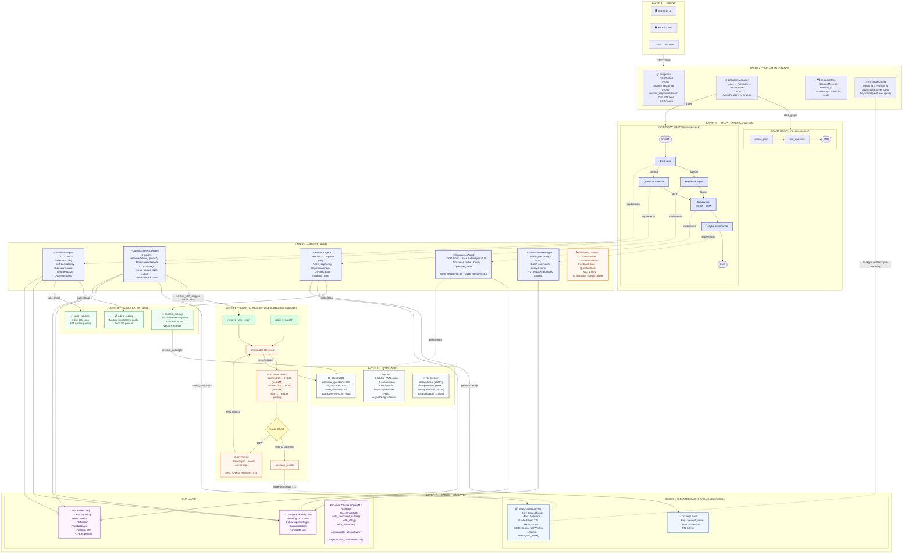

```mermaid
flowchart TD
    %% ─────────────────────────────────────────────
    %% LAYER 1 — CLIENT
    %% ─────────────────────────────────────────────
    subgraph L1["LAYER 1 — CLIENT"]
        direction LR
        UI["🖥 Streamlit UI"]
        REST["⬛ REST Client"]
        SSE["📡 SSE Consumer"]
    end

    %% ─────────────────────────────────────────────
    %% LAYER 2 — API LAYER
    %% ─────────────────────────────────────────────
    subgraph L2["LAYER 2 — API LAYER (FastAPI)"]
        direction LR
        EP["📋 Endpoints
        POST /start
        POST /submit_response
        POST /submit_response/stream
        DELETE /end
        GET /topics"]

        LM["⚙ Lifespan Manager
        LLMs → Prewarm → VectorStore
        → RAG → AgentRegistry → Graphs"]

        SM["🗂 SessionStore
        SessionMeta per session_id
        in-memory · Redis for scale"]

        RC["🔗 RunnableConfig
        thread_id = session_id
        AsyncSqliteSaver (dev)
        AsyncPostgresSaver (prod)"]
    end

    %% ─────────────────────────────────────────────
    %% LAYER 3 — GRAPH LAYER
    %% ─────────────────────────────────────────────
    subgraph L3["LAYER 3 — GRAPH LAYER (LangGraph)"]
        direction LR
        subgraph SG["START GRAPH (no checkpointer)"]
            direction LR
            CP1["create_plan"] --> FQ["first_question"] --> SGE(["END"])
        end

        subgraph IG["INTERVIEW GRAPH (checkpointed)"]
            direction TB
            IGS(["START"]) --> EV["Evaluator"]
            EV -->|fan-out| FB["Feedback Agent"]
            EV -->|fan-out| QS["Question Selector"]
            FB -->|fan-in| SV["Supervisor\nOODA + EMA"]
            QS -->|fan-in| SV
            SV --> MS["Maybe Summarize"]
            MS --> IGE(["END"])
        end
    end

    %% ─────────────────────────────────────────────
    %% LAYER 4 — AGENT LAYER
    %% ─────────────────────────────────────────────
    subgraph L4["LAYER 4 — AGENT LAYER"]
        direction LR
        EA["⚖ EvaluatorAgent
        CoT (14B) + Reflection (7B)
        Self-consistency · Sub-score norm
        Drift detection · Dynamic rubric"]

        FA["💬 FeedbackAgent
        FeedbackComposer (7B)
        Anti-sycophancy · Repetition check
        Off-topic path · Validation gate"]

        QSA["❓ QuestionSelectorAgent
        3 modes: retrieve/follow_up/clarify
        Atomic select+mark (TOCTOU-safe)
        Least-served topic cycling
        5-tier fallback chain"]

        SVA["🎯 SupervisorAgent
        OODA loop · EMA authority (α=0.3)
        2 increase paths · Owns question_count
        MAX_QUESTIONS_HARD_CEILING=15"]

        CMA["📝 ConversationManager
        Rolling window (3 turns)
        Batch summarize every 3 turns
        ~1700 token bounded context"]

        VG["🔒 Validation Gates + CircuitBreaker
        EvaluatorGate · FeedbackGate · QuestionGate
        Max 1 retry · is_fallback=True on failure"]
    end

    %% ─────────────────────────────────────────────
    %% LAYER 5 — TOOLS LAYER
    %% ─────────────────────────────────────────────
    subgraph L5["LAYER 5 — TOOLS LAYER (@tool)"]
        direction LR
        RL["📋 rubric_lookup
        Module-level JSON cache
        Zero I/O per call"]

        CV["✅ code_validator
        3-tier detection
        AST syntax parsing"]

        CL["🧠 concept_lookup
        Module-level singleton
        ChromaDB via VectorRetriever"]
    end

    %% ─────────────────────────────────────────────
    %% LAYER 6 — AGENTIC RAG SERVICE
    %% ─────────────────────────────────────────────
    subgraph L6["LAYER 6 — AGENTIC RAG SERVICE (LangGraph Subgraph)"]
        direction LR
        RWC["retrieve_with_crag()"]
        RB["retrieve_batch()"]
        CHR["ChromaDB Retrieval"]
        DG["DocumentGrader
        score≥0.75 → HIGH (no LLM)
        score≤0.45 → LOW (no LLM)
        else → 7B LLM grading"]
        GC{"Grade Check"}
        QR["QueryRefiner
        3 strategies · cosine anti-repeat
        MAX_CRAG_ATTEMPTS=2"]
        PR["package_results"]

        RWC --> CHR
        RB --> CHR
        CHR --> DG --> GC
        GC -->|HIGH / MEDIUM| PR
        GC -->|LOW| QR
        QR -->|retry max 2x| CHR
    end

    %% ─────────────────────────────────────────────
    %% LAYER 7 — CACHE + LLM LAYER
    %% ─────────────────────────────────────────────
    subgraph L7["LAYER 7 — CACHE + LLM LAYER"]
        direction LR
        subgraph CACHE["SESSION-ISOLATED CACHE (InterviewCacheStore)"]
            direction TB
            TP["📦 Topic Question Pool
            Key: topic:difficulty
            Max 10/session · Grade-based TTL
            HIGH=30min · MED=15min · LOW=skip
            Atomic select_and_mark()"]

            CP2["💡 Concept Pool
            Key: concept_name
            Max 30/session · TTL 60min"]
        end

        subgraph LLM["LLM LAYER"]
            direction TB
            C14["🧠 Complex Model (14B)
            Planning · CoT eval
            Follow-up/clarify gen
            Summarization
            ~2-3s per call"]

            F7["⚡ Fast Model (7B)
            CRAG grading · ReAct select
            Reflection · Feedback gen
            Fallback gen
            ~1-1.5s per call"]

            LP["Provider: Ollama / OpenAI / Anthropic
            BaseChatModel · with_structured_output()
            with_retry() · with_fallbacks()
            configurable_alternatives()
            asyncio.wait_for(timeout=15s)"]
        end
    end

    %% ─────────────────────────────────────────────
    %% LAYER 8 — DATA LAYER
    %% ─────────────────────────────────────────────
    subgraph L8["LAYER 8 — DATA LAYER"]
        direction LR
        CDB["🟢 ChromaDB
        interview_questions: 700
        ml_concepts: 125
        code_solutions: 50
        BGE-base-en-v1.5 · 768d"]

        SDB["🔵 SQLite
        5 tables · WAL mode
        5 connections
        Checkpoints: AsyncSqliteSaver
        Prod: AsyncPostgresSaver"]

        FS["📁 File System
        data/rubrics/ (JSON)
        data/prompts/ (YAML)
        data/questions/ (JSON)
        data/concepts/ (JSON)"]
    end

    %% ─────────────────────────────────────────────
    %% INTER-LAYER CONNECTIONS
    %% ─────────────────────────────────────────────

    %% L1 → L2
    L1 -->|HTTP / SSE| L2

    %% L2 → L3
    LM -->|start_graph| SG
    LM -->|interview_graph| IG

    %% L2 → L7 (pre-warming)
    RC -.->|BackgroundTasks pre-warming| TP

    %% L3 → L4
    EV -.->|implements| EA
    FB -.->|implements| FA
    QS -.->|implements| QSA
    SV -.->|implements| SVA
    MS -.->|implements| CMA

    %% L4 → L5
    EA -->|calls @tool| RL
    EA -->|calls @tool| CV
    FA -->|calls @tool| CL

    %% L4 → L6
    QSA -->|retrieve_with_crag on cache miss| RWC

    %% L4 → L7 cache
    QSA -->|select_and_mark| TP
    FA -->|get/set concept| CP2

    %% L4 → L7 LLM
    EA --> C14
    EA --> F7
    FA --> F7
    QSA --> F7
    QSA --> C14
    SVA --> C14
    CMA --> C14

    %% L5 → L8
    CL -->|retrieve_concepts| CDB

    %% L6 → L8
    CHR -->|vector search| CDB

    %% L6 → L7 cache
    PR -.->|store with grade TTL| TP

    %% L4 → L8
    SVA -.->|persistence| SDB

    %% ─────────────────────────────────────────────
    %% STYLES
    %% ─────────────────────────────────────────────
    classDef agent fill:#eef2ff,stroke:#4f46e5,stroke-width:2px,color:#1e1b4b
    classDef tool fill:#f0fdf4,stroke:#16a34a,stroke-width:1.5px,color:#14532d
    classDef rag fill:#fff7ed,stroke:#ea580c,stroke-width:1.5px,color:#7c2d12
    classDef cache fill:#eff6ff,stroke:#2563eb,stroke-width:1.5px,color:#1e3a5f
    classDef llm fill:#fdf4ff,stroke:#9333ea,stroke-width:1.5px,color:#3b0764
    classDef data fill:#f8fafc,stroke:#475569,stroke-width:1.5px,color:#1e293b
    classDef gate fill:#fff8f0,stroke:#f97316,stroke-width:2px,color:#7c2d12
    classDef gnode fill:#e0e7ff,stroke:#4f46e5,stroke-width:2px,color:#1e1b4b
    classDef decision fill:#fef9c3,stroke:#ca8a04,stroke-width:2px,color:#713f12
    classDef entry fill:#dcfce7,stroke:#16a34a,stroke-width:1.5px,color:#14532d

    class EA,FA,QSA,SVA,CMA agent
    class RL,CV,CL tool
    class CHR,DG,QR,PR rag
    class TP,CP2 cache
    class C14,F7,LP llm
    class CDB,SDB,FS data
    class VG gate
    class EV,FB,QS,SV,MS gnode
    class GC decision
    class RWC,RB entry
```
